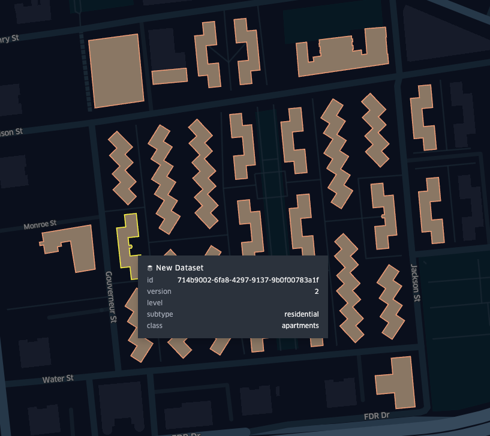
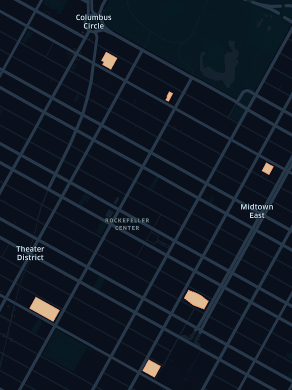

# `fast-geoparquet-features`

A simple GeoParquet feature server built with FastAPI and DuckDB. Query, filter, and serve vector data straight from GeoParquet in object storage.

✨ Features

* 🚀 Serve GeoParquet directly via HTTP endpoints
* ⚡ Fast queries with DuckDB (spatial extension enabled)
* 🗂️ Filter features by bounding box or CQL expressions
* 🌍 GeoJSON, GeoJSONSeq/ndjson, and CSV output formats supported
* 🐍 Modern Python stack with FastAPI + async streaming responses

> [!WARNING]
> This is a tech demo/prototype. Expect bugs and breaking changes.

## Setup

* `uv sync`
* `uv run fastapi dev main.py`
* Open `http://localhost:8000/docs` in your browser to view the interactive Swagger docs

> [!TIP]
> If request errors occur when querying datasets in S3, try setting `AWS_REGION=<dataset-region>` in your environment.

## Examples

### Features API

Features are served from the `/features` endpoint. Here are some examples of querying Overture Foundation's Buildings dataset directly in S3.

* Bounding box filter:

    ```sh
    $ curl -X 'GET' \
    'http://localhost:8000/features?url=s3%3A%2F%2Foverturemaps-us-west-2%2Frelease%2F2025-08-20.1%2Ftheme%3Dbuildings%2Ftype%3Dbuilding%2F%2A&limit=100&bbox=-73.98407324497613,40.711304868311316,-73.98038796085099,40.713572466980054' | jq > data/demo.geojson
    ```

    * [Result](./data/demo.geojson)
        

* Bounding box and CQL2-Text filter (`height > 350`):

    ```sh
    $ curl -X 'GET' \
    'http://localhost:8000/features?url=s3%3A%2F%2Foverturemaps-us-west-2%2Frelease%2F2025-08-20.1%2Ftheme%3Dbuildings%2Ftype%3Dbuilding%2F%2A&filter=height%20%3E%20350&f=geojson&bbox=-73.99341797466995%2C40.75292045436345%2C-73.95647120320056%2C40.777695601276434' | jq > data/height-filter-demo.geojson
    ```

    * [Result](./data/height-filter-demo.geojson)

        

## Vector Tiles API

MVT/PBF vector tiles are served from the `/tiles/{z}/{x}/{y}` endpoint. A simple map view is available at the `/viewer` endpoint.

> [!WARNING]
> Vector tile generation can be pretty slow (on the order of seconds to tens of seonds), even after the initial metadata scan.
> Running with multiple workers (e.g., `uv run fastapi run main.py --workers=4`) can improve performance by distributing
> request processing across threads.

* Example: [http://localhost:8000/viewer?url=s3://overturemaps-us-west-2/release/2025-08-20.1/theme=buildings/type=building/*](http://localhost:8000/viewer?url=s3://overturemaps-us-west-2/release/2025-08-20.1/theme=buildings/type=building/*)

    

## Notes

* Bounding box filtering requires GeoParquet created with bbox/covering metadata as described in [the v1.1.0 spec](https://geoparquet.org/releases/v1.1.0/)
* Performance is best with [a spatially sorted GeoParquet](https://github.com/opengeospatial/geoparquet/blob/main/format-specs/distributing-geoparquet.md)
* The first query of a large and/or partitioned GeoParquet will take significantly longer than subsequent queries due to the initial scan of the Parquet metadata (which DuckDB caches and reuses). For example, the first query of the Overture Buildings dataset after a fresh start takes ~30s. After that, the same query is signficantly faster.
* Vector tile latency is...not great. TBH, it's not too surprising given the network hops and computation involved in generating each tile. The queries are pretty straightforward, but maybe there are parameter tweaks or SQL-fu that could speed things up? LMK! Deploying the service colocated with the data, horizontal scaling, and/or aggressively caching requests could also improve responsiveness, but at that point maybe PMTiles is a simpler solution?

## Acknowledgements

This project was inspired by and benefits from some really cool open source projects including:

* [tipg](https://developmentseed.org/tipg/)
* [cql2-rs](https://developmentseed.org/cql2-rs/latest/)
* [duckdb](https://github.com/duckdb/duckdb)
* [duckdb spatial extension](https://github.com/duckdb/duckdb-spatial)
* [GeoParquet](https://github.com/opengeospatial/geoparquet)
